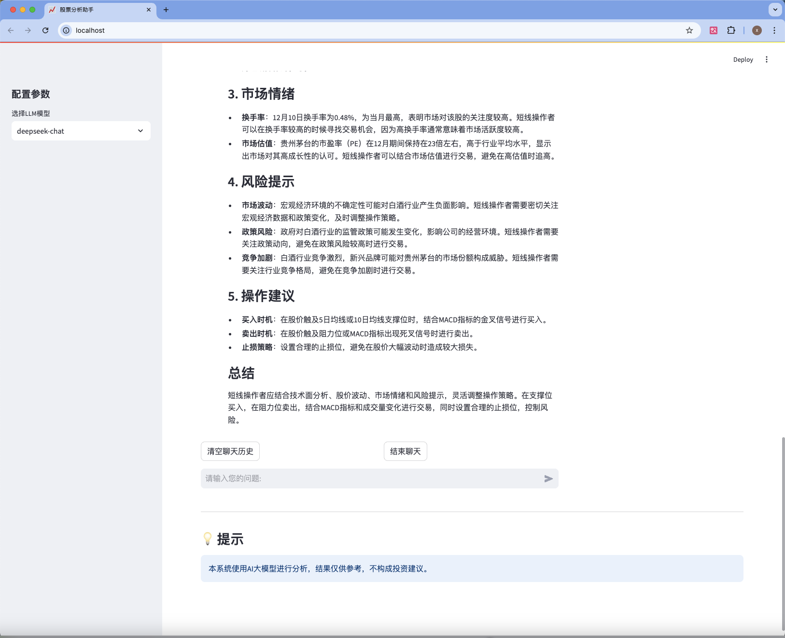

# 智能股票分析助手 (FinChat)

一个基于中国大语言模型的智能股票分析工具，能够生成股票研报并提供智能问答服务。
<div align="center">
    
</div>

## 🌟 功能特点

- 🤖 支持多种大语言模型（GLM-4-plus、Deepseek-chat），无需科学上网，都是国内大模型
- 📊 自动生成股票分析研报
- 💬 智能问答功能，可针对研报内容进行深入讨论
- 🔄 实时流式响应
- 📈 可自定义分析时间范围
- 🎯 直观的Web界面

## 🏗️ 技术架构

- 🔄 基于ReAct架构的智能Agent系统
- 📚 RAG (Retrieval-Augmented Generation) 增强的工具调用机制
- 🛠️ 自适应代码生成与执行框架
- 📊 实时数据获取与分析引擎
- 🌐 Streamlit构建的交互式Web界面

## 💡 创新特点

1. **突破性的Agent交互模式**
   - 创新采用Agent自主编写代码获取数据
   - 基于ReAct架构实现Agent自反思与代码优化
   - 支持运行结果反馈，实现闭环迭代改进

2. **革新性的工具调用机制**
   - 突破传统Function Call的限制
   - 创新采用RAG模式管理工具库
   - 支持千级别工具的灵活调用
   - 有效解决海量工具超出上下文限制的问题

3. **智能化的代码执行系统**
   - 支持代码自动生成与优化
   - 实时执行结果分析
   - 错误自动诊断与修正

## 🛠️ 安装说明

1. 克隆项目
```bash
git clone https://github.com/yourusername/FinChat.git
cd FinChat
```

2. 创建并激活虚拟环境（推荐）
```bash
conda create -n finchat python=3.11
conda activate finchat
```

3. 安装依赖
```bash
pip install -r requirements.txt
```

4. 配置环境变量
创建 `.env` 文件并添加以下配置：
```env
# 智谱AI配置
zhipu_api_key=your_zhipu_api_key
zhipu_base_url=your_zhipu_base_url

# Deepseek配置
deepseek_api_key=your_deepseek_api_key
deepseek_base_url=your_deepseek_base_url
```
需要自行去官网获取api，目前使用了zhipu的embedding模型，可以自行替换。
## 🚀 使用方法

1. 启动应用
```bash
streamlit run app.py
```

2. 在浏览器中访问 `http://localhost:8501`

<div align="center">
    
</div>

3. 使用步骤：
   - 在左侧边栏选择要使用的LLM模型
   - 输入股票名称（如：贵州茅台）
   - 选择分析的时间范围
   - 点击"开始分析"按钮

   <div align="center">
    
    </div>

   - 等待分析完成后，可以查看研报并进行智能问答
<div align="center">
    
</div>
<div align="center">
    
</div>


## 📝 注意事项

- 股票名称需要输入完整的名称
- 分析时间范围不宜过长，以免影响分析速度
- 本系统生成的分析结果仅供参考，不构成投资建议
- 请确保您的API密钥配置正确且有足够的额度

## 🔒 隐私说明

- 本项目不会存储任何用户的个人信息
- API密钥仅用于与AI服务商通信，请妥善保管

## 📄 许可证

MIT License

## 🤝 贡献指南

欢迎提交 Issue 和 Pull Request 来帮助改进项目。

## 📞 联系方式

如有问题或建议，请通过 Issue 与我们联系。