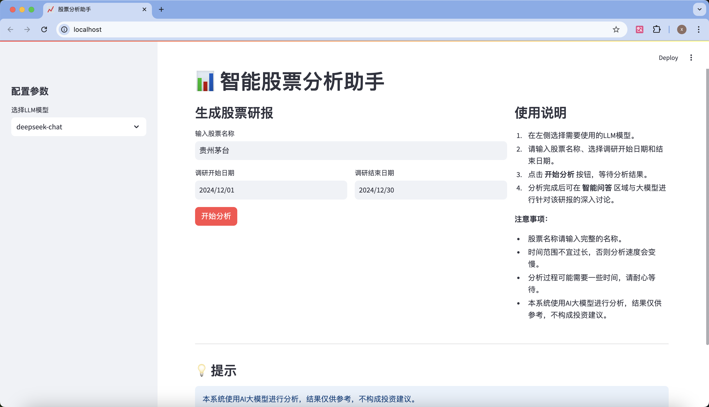
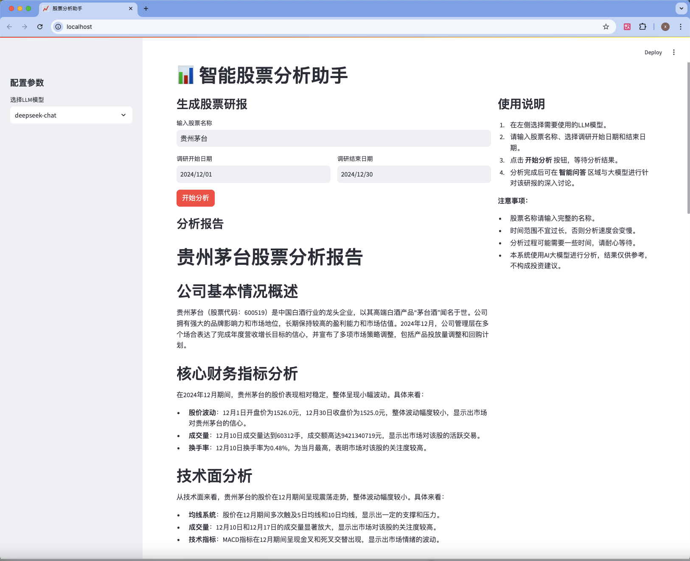
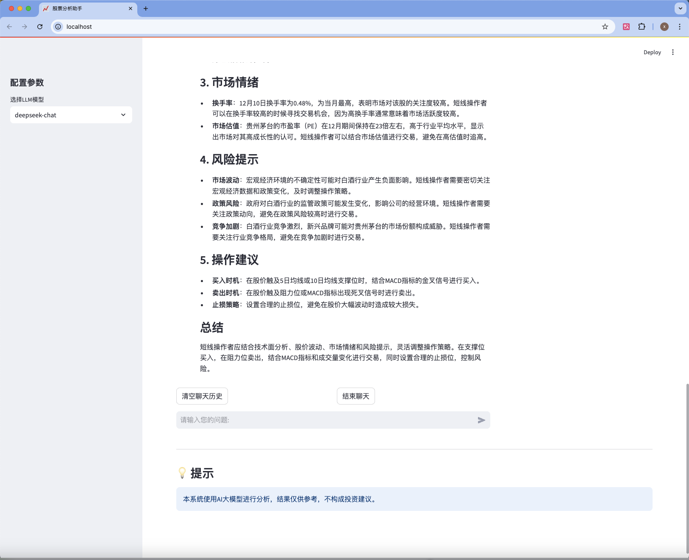
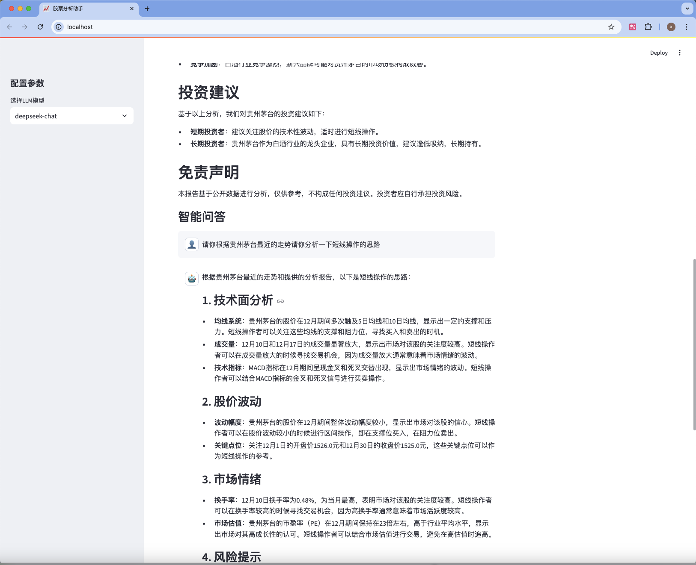

# streamlit demo 使用介绍
1. 启动应用
```bash
streamlit run app.py
```

2. 在浏览器中访问 `http://localhost:8501`

<div align="center">
    
</div>

3. 使用步骤：
   - 在左侧边栏选择要使用的LLM模型
   - 输入股票名称（如：贵州茅台）
   - 选择分析的时间范围
   - 点击"开始分析"按钮

   <div align="center">
    
    </div>

   - 等待分析完成后，可以查看研报并进行智能问答
<div align="center">
    
</div>
<div align="center">
    
</div>